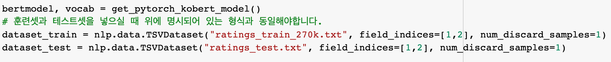

# 2020 국어 정보 처리 시스템 경진 대회 - 네이버 영화평 감성분석기 with BERT

주의사항

훈련셋과 테스트셋을 넣으실 때, 공개되어있는 네이버 영화평 데이터셋과 동일한 형태(탭으로 구분된 파일)로 넣어주셔야합니다.

colab을 통해 직접 코드를 실행할 수 있도록 링크를 공유합니다. 런타임 유형을 GPU로 변경해주세요.
https://colab.research.google.com/drive/1TgBYKUO5gPcw56LVQJ67zr3GyBlcRlCc#scrollTo=LiyV8x-WBj6L

아래는 훈련 학습시킨 모델 다운로드 링크입니다. 코드는 파이토치 기반으로 작성되었습니다.
https://drive.google.com/file/d/100onc09TYTSiOi47JSvYfgD6kC898WAa/view?usp=sharing
